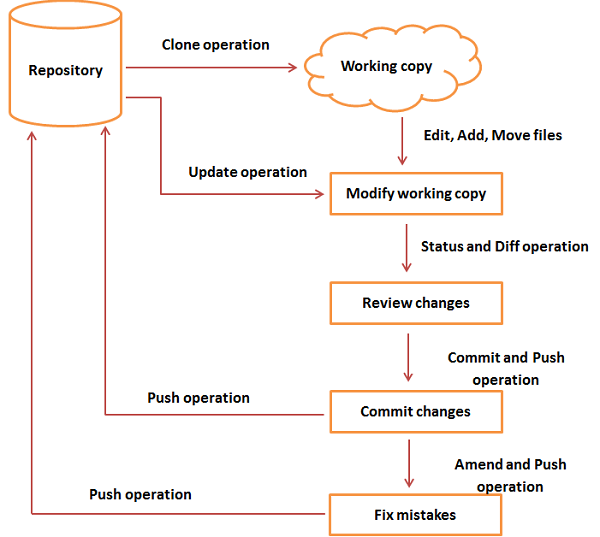

## Git
Git is an open-source distributed version control system. It is developed to co-ordinate the work
among the developers.

## Features
1. Open source
2. Scalable and Distributed
3. Speed and Security
4. Branchig and Merging
5. Maintain clean history

## Benefits
1. Saves time
2. Support offline working
3. Undo mistakes
4. Track changes
5. Implicit backup

## Terminology
| **Term**    |                 **Description**                         |
|-------------|---------------------------------------------------------|
| branch      | Version of repository diverted from main project        |
| checkout    | Switch between branches                                 |
| cherry pick | Apply commit from one branch to another                 |
| clone       | Copy main repository                                    |
| fetch       | Fetch details from main repository                      |
| head        | Last commit on checkout branch                          |
| index       | Staging area between workspace and repository           |
| master      | Default branch name                                     |
| merge       | Merging two branches                                    |
| origin      | Reference to remote repository from a project was cloned|
| pull        | Get data from repository                                |
| push        | Push data from repository                               |
| squash      | Combining commits                                       |
| remote      | Remote repository                                       |
| repository  | Contain project files                                   |
| tag         | Meaningful names to a specific version in the repository|
| revert      | Revert to commit                                        |
| ignore      | Ignore file                                             |
| diff        | Difference between repository and local                 |
| rebase      | Combining commits to lastest commit                     |
| rm          | Remove file                                             |
| fork        | Copy of branch                                          |

## Command
| **Command**   |                 **Description**               |                   **Example**                                          |
|---------------|-----------------------------------------------|------------------------------------------------------------------------|
| config        | Configures the user                           |  ```git config --global user.name argmishra```                         |           
| config list   | List of Configuration                         |  ```git config --list``` 						                         |
| init          | Initialize an empty repository                |  ```git init Demo```                                                   |
| clone         | Make a copy of a repository from an given URL |  ```git clone "URL"```                                                 |
| add           | Add one or more files                         |  ```git add .```                                                       |
| commit        | Commit file                                   |  ```git commit -m/-a```                                                |
| status        | State of working directory                    |  ```git status```                                                      |
| push          | Push from local to remote repository          |  ```git push```                                                        |
| pull          | Pull from remote to local repository          |  ```git pull```                                                        |
| branch        | Show all branches                             |  ```git branch```                                                      |
| merge         | Merge braches                                 |  ```git merge "branch_name"```                                         |
| log           | Check commit history                          |  ```git log```                                                         |
| remote        | Connect to remote repository                  |                                                                        |
| stash         | Save at temporary location and revert         |  ```git stash show/save/list/apply/changes/drop/clear/nranch/pop```    |
| ignore        | Ignore file(s)                                |  ```git ignore -i "file_name" ```                                      |
| create branch | Create a branch                               |  ```git branch "branch_name"```                                        |
| delete branch | Delete a branch                               |  ```git branch -d "branch_name"```                                     |
| revert        | Revert some changes                           |  ```git revert "commit_id"```                                          |
| rm            | Remove file                                   |  ```git rm "file_name"```                                              |
| cherry-pick   | Cherry pick particular commit                 |  ```git cherry-pick "commit_id"```                                     |
| show          | Show deatil of particular commit              |  ```git show "commit_id"```                                            |
| mv            | Move from one location to another/Rename      |  ```git mv "old" "new"```                                              |
| create tag    | Create a tag                                  |  ```git tag -a "name"```                                               |
| delete tag    | Delete a tag                                  |  ```git tag -d "name"```                                               |
| show tags     | Show all tags                                 |  ```git tag -l```                                                      |
| create patch  | Create a patch                                |  ```git format-patch -1```                                             |
| apply patch   | Apply a patch                                 |  ```git apply "patch_name"```                                          |
| rename branch | Rename a branch                               |  ```git branch -m "old_name" "new_name"```                             |

## Flow



