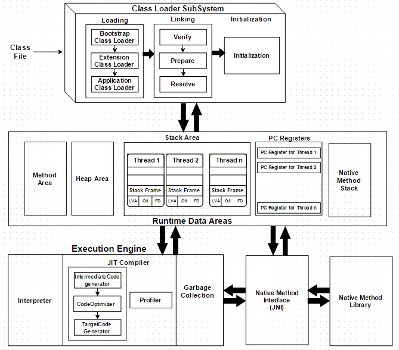

# JVM
A virtual machine is a software implementation of a physical machine. The compiler compiles the Java file into a Java .class file, then that .class file is input into the JVM, which loads and executes the class file. 

# JVM Sub Systems
1. ClassLoader
2. Memory Area
3. Execution Engine

## Class Loader
It loads, links and initializes the class file. There are three types of class loader which are:-

* BootStrap ClassLoader - To load all core java classes i.e. rt.jar.
* Extension ClassLoader - To load classes from extension class path.
* Application ClassLoader - To load classes from application class path.

**1. Loading** -> It reads java .class files and store corresponding binary data in the method area. Once the loading of a file is completed, JVM will create an object for class Class type in Heap memory. For each file, JVM will store the following information in the method area:-
  
  * Fully qulaifies name 
  * Fully qulaifies name of immediate parent class
  * Type of file i.e enum, class or interface
  * Modifiers information
  * Variable information
  * Method information
  * Constant Pool

**2. Linking** -> It consists of three activities which are:-
  
  * Verification - This verifies that binary representation is correct or not and the .class file generated by the valid compiler which is done by byte code verifier.
  * Preparation - JVM will allocate memory for the class static variable and assign the default value.
  * Resolution - Replacing all symbolic references used in our class with original references from the method area.
   
**3. Initialization** -> All static variables will be assigned with original values and static blocks are executed.

## Memory Area
It is divided into five major components:

**1. Method Area** –> All the class-level data will be stored here, including static variables. There is only one method area per JVM, and it is a shared resource.

**2. Heap Area** –> All the objects and their corresponding instance variables and arrays will be stored here. There is also one heap area per JVM. Since this share memory for multiple threads, the data stored is not thread-safe. It is created on JVM startup.

**3. Stack Area** –> For every thread, a separate runtime stack will be created. For every method call, one entry will be made in the stack memory which is called Stack Frame. All local variables will be created in the stack memory. The stack area is thread-safe since it is not a shared resource. 

The Stack Frame is divided into three subentities:
  * Local Variable Array – Related to the method how many local variables are involved and the corresponding values will be stored here.
  * Operand stack – If any intermediate operation is required to perform, operand stack acts as runtime workspace to perform the operation.
  * Frame data – All symbols corresponding to the method is stored here. In the case of any exception, the catch block information will be maintained in the frame data.

**4. PC Registers** –> Each thread will have separate PC Registers, to hold the address of current executing instruction once the instruction is executed the PC register will be updated with the next instruction.

**5. Native Method stacks** –> Native method stack holds native method information. For every thread, a separate native method stack will be created.

## Execution Engine
This is the central component for JVM. It is responsible to execute the java class file. It consists below components:-

**1. Interpreter** -> It read byte code, convert into machine/native code and execute it line by line.

**2. Just In Time Compiler** -> In case the same code is used, the JIT compiler complies with repeated code and converts it into machine code which eventually increases the performance of the system. The components are as follows:- 
 
   * Intermediate Code Generator - Produce intermediate code
   * Code Optimizer - Optimize above code
   * Target Code Generator - Generate native code 
   * Profiler - To find hotspots i.e. whether the method is called multiple times or not.

**3. Java Native Interfaces** -> Interface to provide native libraries required by the execution engine.

**4. Native Method Libraries** -> Collection of native libraries

# JVM Architecture Diagram
